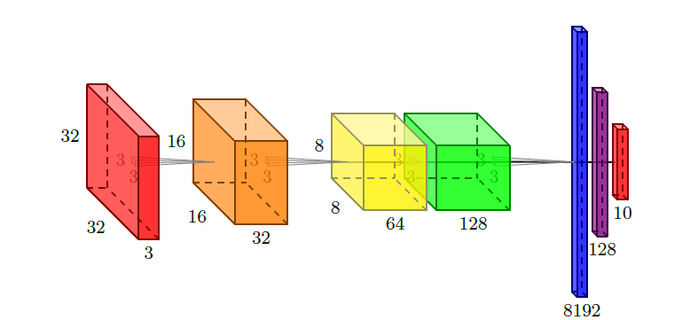
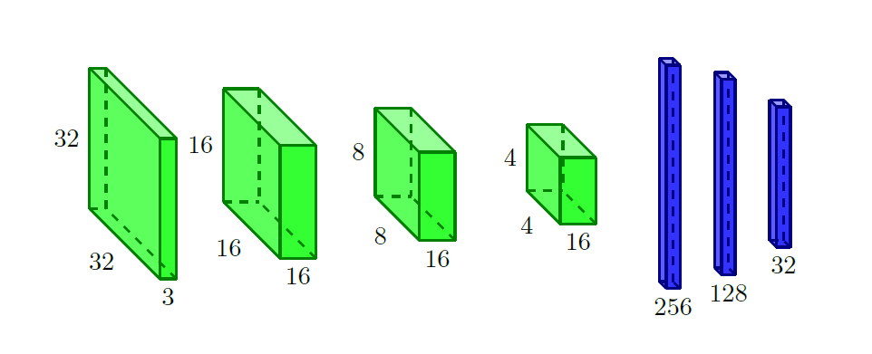

# CNNLaTeX package v0.1: CNN representation in LaTeX

## 3D representation of neural networks in LaTeX




This package aims to allow the user to easily create CNN representations in LaTeX. It is based on the TikZ package and allows the user to create 3D representations of CNN architectures, with support for pooling, convolution and fully connected layers. More types of layers will be supported in further versions.




The recommended way to use this package is to, after cloning it to your LaTeX project, create a JSON representation of your CNN architecture (you can change the JSON files in the `example` folder to what suits you) and then use the provided Python script to generate the LaTeX code:

```bash
python3 json_create.py (path_to_json) > (output_file)
```

You can then import the generated .tex file into your LaTeX project and compile it. You will get a PDF file with the representation of your CNN architecture.

Some of the examples in the `example` folder are already converted into .tex files in the `tex` folder, as well as features to add to the python script, and are imported into the `main.tex` file. The compiled output is available in the `main.pdf` file.